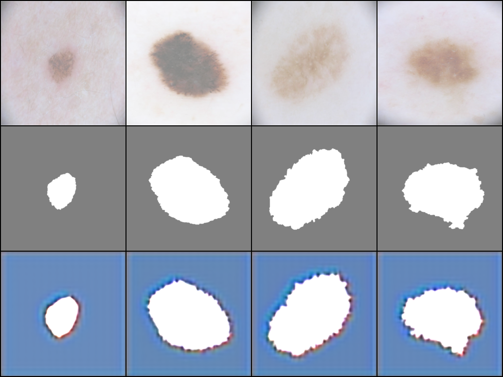

## TransDiff
<sub>A Medical Image Segmentation Model with Diffusion Probabilistic Model</sub>

## Structure
 The architecture of TransDiff, which is composed of VAE, Diffusion Transformer, and Condition Encoder.
 


## Effect
The segmentation results of different methods on the ISIC dataset.



## Setup

First, download and set up the repo:

```bash
git clone https://github.com/facebookresearch/TransSegDiff.git
cd TransSegDiff
```

run the models locally on GPU.

```bash
python main.py
```
